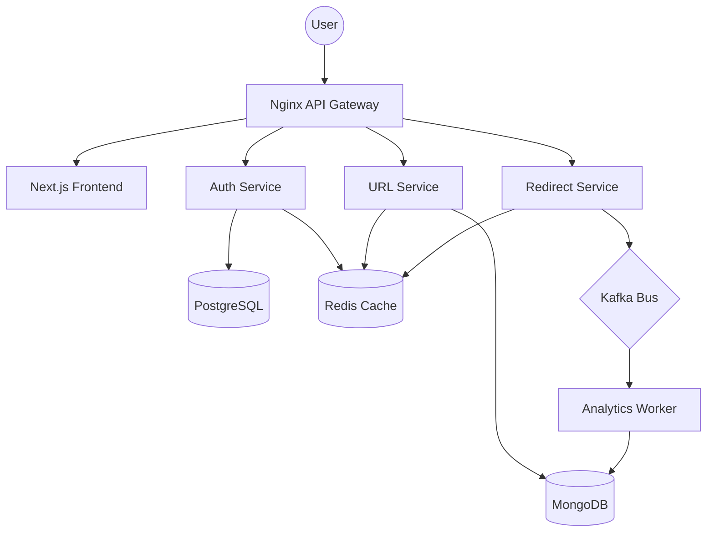

# Shrinkr — Professional Microservices URL Shortener

Shrinkr is a blazing-fast, production-grade URL shortener built with a modern microservices architecture. It features secure cookie-based authentication, real-time click analytics, and a premium glassmorphic frontend.

## 🚀 Key Features

- **Blazing Fast Redirects**: Sub-millisecond redirects powered by Redis caching.
- **Microservices Architecture**: decoupled services for Auth, URL Management, Redirect Engine, and Analytics.
- **Event-Driven Analytics**: Click data is processed asynchronously using Kafka to ensure zero latency for the end-user.
- **Secure Authentication**: Multi-factor auth with OTP and HTTP-only cookie-based JWT sessions.
- **Modern UI**: A premium, responsive Next.js frontend with glassmorphism and real-time notifications (Toasts).
- **Professional Emails**: Beautifully designed HTML templates for verification codes.
- **Dockerized**: Entire stack is containerized for seamless development and deployment.

## 🏗️ Architecture

Shrinkr follows a distributed architecture to ensure scalability and reliability.



### Service Breakdown

1.  **Nginx Gateway**: Acts as the entry point, routing traffic to the frontend and backend services while handling SSL and rate limiting.
2.  **Auth Service**: Handles user registration, login, and OTP verification. Persists user data in PostgreSQL and manages active sessions/OTPs in Redis.
3.  **URL Service**: Provides CRUD operations for short links. Validates ownership via JWT and stores metadata in MongoDB.
4.  **Redirect Service**: The "hot path". Resolves short IDs to original URLs using Redis for instant lookups (falling back to Mongo). Publishes click events to Kafka.
5.  **Analytics Worker**: Consumes click events from Kafka and updates MongoDB with geographic, browser, and timestamp data.

## 🛠️ Tech Stack

- **Frontend**: Next.js 14, Tailwind CSS, Radix UI, Lucide React, Zustand.
- **Backend**: Node.js, Express, Prisma (ORM), Mongoose.
- **Databases**: PostgreSQL (Auth), MongoDB (URLs/Stats), Redis (Cache/Sessions).
- **Messaging**: Apache Kafka & Zookeeper.
- **Infrastructure**: Nginx, Docker, Docker Compose.

## 🏁 Getting Started

### Prerequisites

- [Docker](https://www.docker.com/get-started)
- [Docker Compose](https://docs.docker.com/compose/install/)

### Installation

1. **Clone the repository**:
   ```bash
   git clone https://github.com/ayushsoni155/Shrinkr.git
   cd Shrinkr
   ```

2. **Configure Environment**:
   Initialize your `.env` file (the `docker-compose.yml` uses `.env` by default for infrastructure).
   ```bash
   cp .env
   ```

3. **Start the Stack**:
   ```bash
   docker compose --env-file .env  up --build -d
   ```

4. **Access the App**:
   - Frontend: `http://localhost:80` (Standard HTTP)
   - API Docs: Refer to the [Architecture section](#architecture) for routing.

## 📖 API Reference (Internal Ports)

| Service | Port | Endpoint | Description |
|---|---|---|---|
| Auth | 4001 | `/api/auth/login` | Secure JWT Login |
| URL | 4002 | `/api/urls` | Manage Short Links |
| Redirect | 4003 | `/:shortId` | High-performance Redirect |

## 🛡️ Security Features

- **HTTP-Only Cookies**: JWTs are stored in secure cookies to prevent XSS attacks.
- **Rate Limiting**: Express middleware prevents brute-force attacks on sensitive endpoints.
- **Input Validation**: Strict schema validation using `express-validator`.
- **Pro Email Design**: Anti-phishing, professional email templates for OTP delivery.

## 📝 License

Distributed under the MIT License. See `LICENSE` for more information.

---
Built with ❤️ by [Ayush Soni](https://github.com/ayushsoni155)
